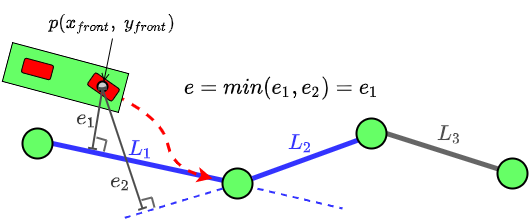

# RRT-star_pygame

This repository contains the source code of a sampling-based motion planning to autonomously move a robot along a trajectory in a static environment in a parking lot scenario. Both RRT and RRT* single query path planning algorithms were implemented without the use of a planner module, and investigated. A PD controller allows the robot, represented by a kinematic bicycle model, to follow the computed path.

The RRT method and (visualisation using Pygame) were implemented by following a video tutorial. However, the RRT* method and the bicycle model and controller have been implemented without following any tutorials.

Regarding the motion control for the bicycle mobile robot, the steering angle is given by a PD controller using an error e. The error e is defined as the shortest distance(normal distance) between the point of the robot on the front wheel and the 'current' edge. The front wheel position is chosen instead of the center of the robot because it causes less overshoot at the nodes. The error e is calculated as shown in the following figure: 

  

To run the simulation, please move to '/path/to/code/', open 'main.py' and enter the right path found on [this line](https://github.com/yohanlegars/RRT_RRT-star_mobilerobot_pygame/blob/000938339ba1c2b761536418969c8b1546889ade/code/main.py#L15).
Furthermore, you can choose between RRT and RRT* by defining [RRT_STAR](https://github.com/yohanlegars/RRT_RRT-star_mobilerobot_pygame/blob/000938339ba1c2b761536418969c8b1546889ade/code/main.py#L13) False or True, respectively.

Then, in the current directory, you can run:
'python main.py'

